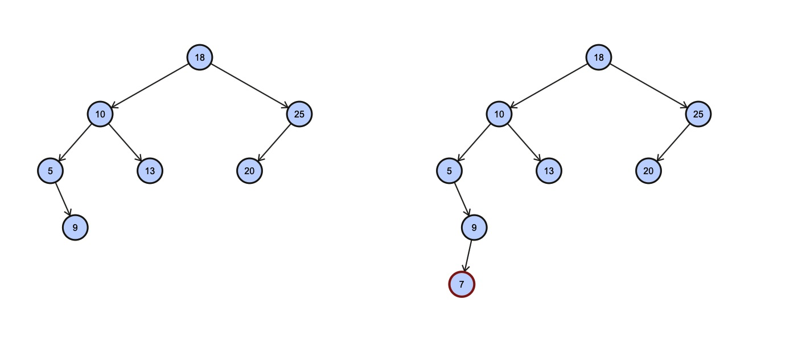

Answer the following questions regarding the insertion of `7` in this AVL tree:

1. What are the nodes that require recalculations of their balance factors due to the insertion of the node with value `7`?
2. When examining the node with value `5`, what are the steps involved in checking if it violates the balance property or not?
3. What is the time complexity of balance checking at a given node in Big-O Notation?
4. What is the overall time complexity of the insert operation in Big-O Notation?
5. Does the answer in #4 match the height of the tree?

  
Solution

1. Nodes with value 9, 5, 10, and 18 require recalculations of their balance factors. 
2. First calculate the heights of the two subtrees. Then, using the heights, we can calculate the balance factor.  Lastly, we can balance the tree based on the balance factor (if neccessary).
3. $O(1)$. 
4. $O(\log N)$. Since the height of avl tree with $N$ nodes is at most $O(\log N)$, the time complexity of the insert operation, which is dependent on the height of the avl tree, should be $O(\log N * 1)$.
5. Yes, they are both $O(\log N)$.

***Hint***: If the complexity of balance checking at a given node is $O(1)$, what should be the time complexity of calucating the height of a given subtree?

 

  
Note

1. This allows students to think about the implementation of the insert operation
   (only check nodes that have been traversed before on the way back from the recursion) and allows for calculations in Q4.

2. This is once again allowing students to think about the implementation of balance checking at a specific node.

3. The time complexity must be constant. This will be the subtle way of telling the students that calculating height must
   be done in constant time.

4. Using the answer from Q1 and some generalization of the height of the bbst, the answer will be arrived to $O(\log N)$

5. This question has two objectives. One, it makes sure that student arrive to correct answer in Q4. Two, it adds emphasis on the height of the bbst to be $\log N$.

