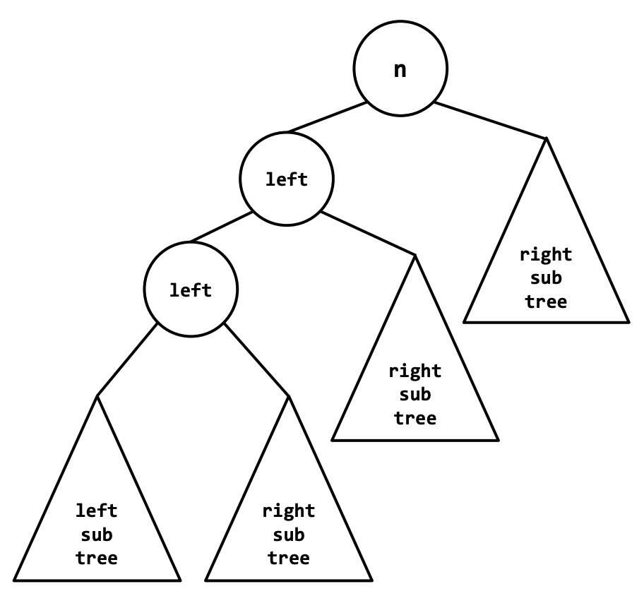
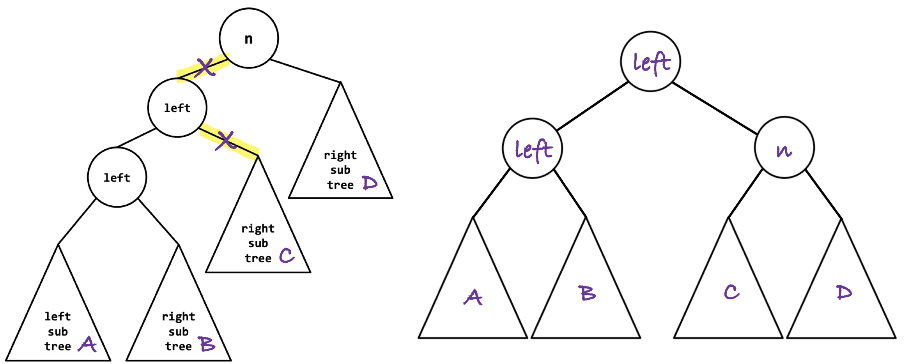

Write an algorithm to do a <u>singleRight</u> rotation on a given node that has left and right children references. Assume it would be called on node `n` below as an example.




<details class="solution">
  <summary>Solution</summary>
  
```java
Node singleRight (Node n) {
  Node child = n.left; //bring up this child
  n.left = child.right; 
  child.right = n;
  return child; //new root 
}
```




</details>
