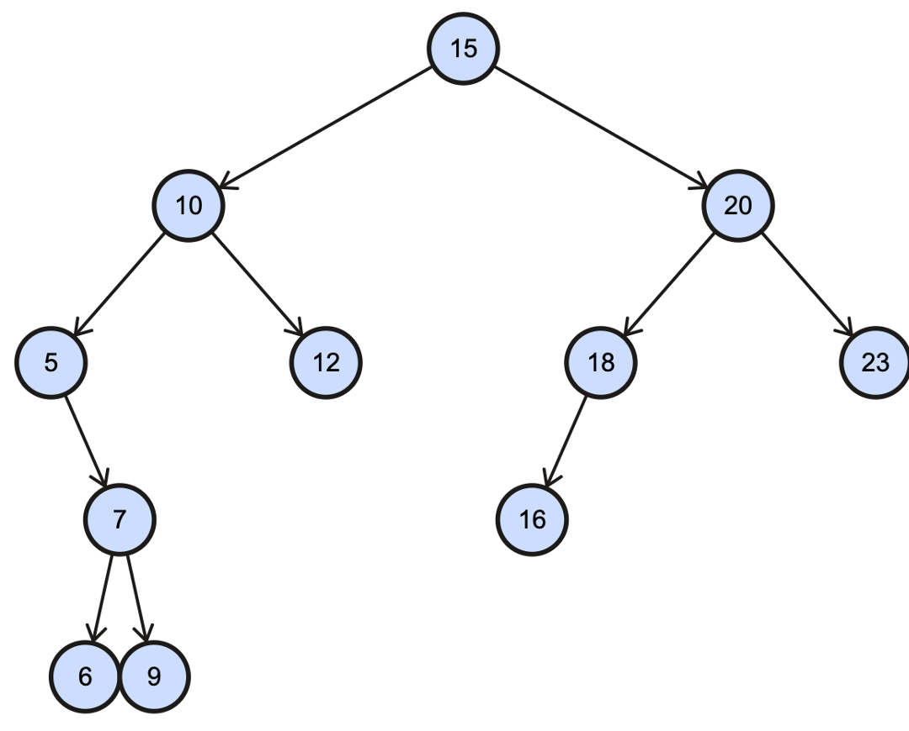
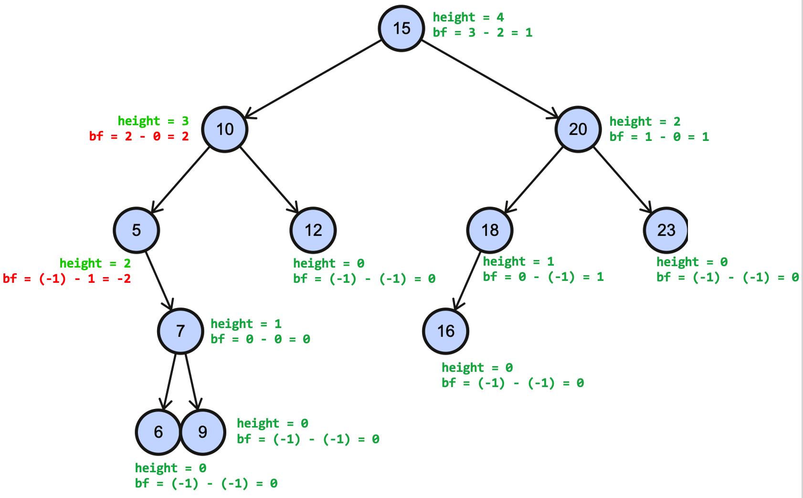

1. Compute the balance factor for every node:

> Recall `bf(node) = height(node.left) – height(node.right)`




2. What is the balance factor of the node `10`?
   - (A) `2`
   - (B) `3`
   - (C) `-2`
   - (D) `-3`

3. What is the balance factor and height of the node `5`?
   - (A) `BF = 1`, `Height = 2`
   - (B) `BF = 1`, `Height = 3`
   - (C) `BF = -2`, `Height = 3`
   - (D) `BF = -2`, `Height = 2`

4. When calculating the balance factor of every node: 
   - (A) subtract the balance factor of the left subtree minus the right subtree
   - (B) subtract the balance factor of the right subtree minus the left subtree
   - (C) subtract the height of the left subtree minus the right subtree
   - (D) subtract the height of the right subtree minus the left subtree
   
5. Consider the following tree:

    ```plain
                 20
                /  \
               10    30
                    /  \
                   5   40
    ```
    Is this a binary tree, BST, or BBST? Why?
    
6.  Using the following numbers, `[4, 1, 3, 9, 29, 30, 27, 21]`, construct a binary tree (that is not a BST or BBST), a BST, and a BBST. 

<details class="solution">
  <summary>Solution</summary>

1. 

   

2. - (A) The height of the left subtree is $2$ and the height of the right subtree is $0$ (a leaf has a height of $0$). Balance factor is $2-0= 2$. 

3. - (D) Node $5$ has two children, so it's height is $2$. The height of the left subtree is $-1$ (nonexistent) and the height of the right subtree is $1$. Balance factor is $-1-1 = -2$. 

4. - (C) Balance factors are dependent on the HEIGHTS of a node's left and right subtrees, not the balance factors of the left and right subtrees. The balance factors of the left and right subtrees themselves would be calculated from the heights of their own left and right subtrees. BF = Height of left subtree $-$ height of right subtree. 
   
5. This is a binary tree. The 5 violates the BST property because it is smaller than 20 (root) yet it is on the right subtree. All values in the right subtree should be greater than the current node (root in this case).

6. Answers may vary. 

   Binary tree example: (should only satisfy the property that each node has at most 2 children)

    ```plain
             1 
            / \
           3   29
          / \
         4  21
        / \
       30  9
          /
         27
    ```
    Binary search tree example: (should satisfy the binary tree property and the BST property)

    ```plain
            21
         /      \
        1       27
         \        \
          3       29
           \       \
            4       30
             \
              9
    ```
     Balanced binary search tree: (needs to satisfy the binary tree property, BST property and BBST height property)

    ```plain
              9
           /     \
          3        27
        /   \     /   \
       1     4   21   29
                        \
                         30 
    ```

</details>
