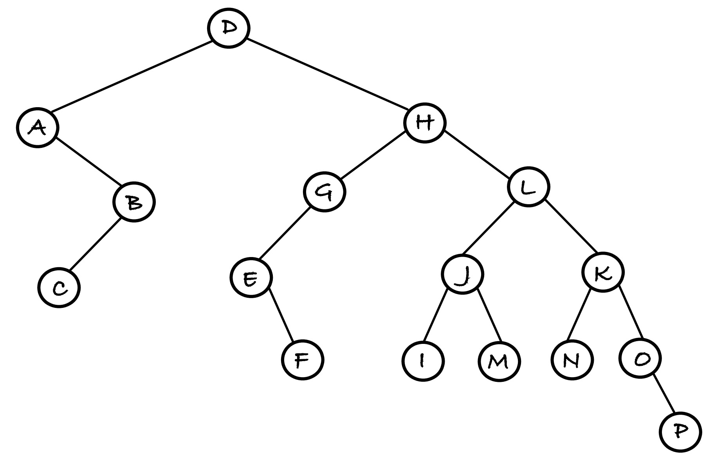
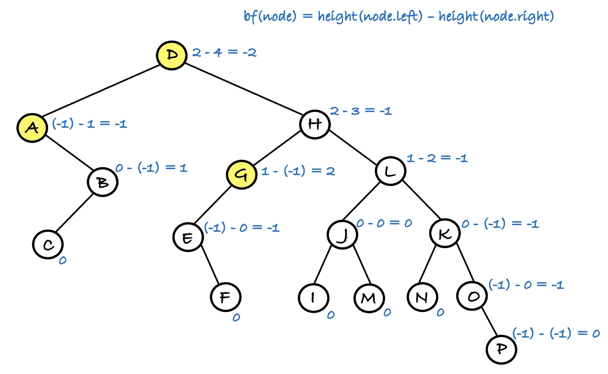

Could this tree be a balanced binary search tree? If not, list every instance of all BBST violations by indicating roots of all non-BBST compliant subtrees.

  
Solution

A violation of the order property can be seen through an in order traversal: 
A, <u>C, B,</u> D, E, F, G, M, I, J, <u>M, L, N, K,</u> O, P

A violation of the balance property exists in nodes D, A, and G: 

